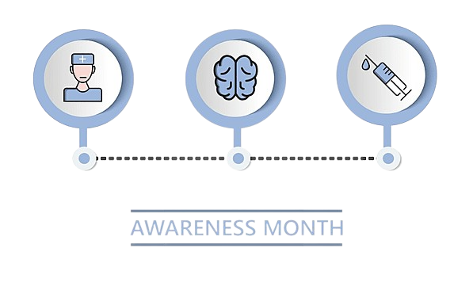
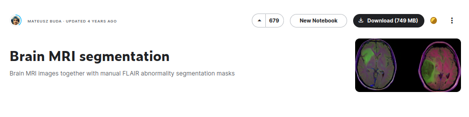
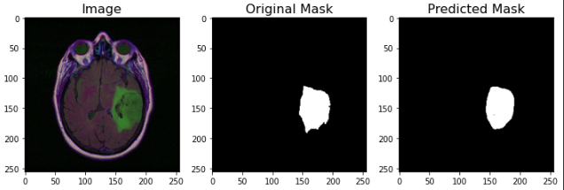
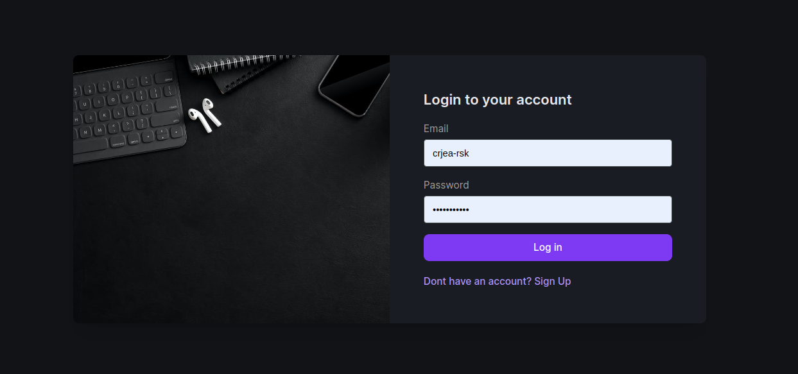

# Brain Tumor Detection With U-NET
<a name="readme-top"></a>
[![Contributors][contributors-shield]][contributors-url]
[![Forks][forks-shield]][forks-url]
[![Stargazers][stars-shield]][stars-url]
[![Issues][issues-shield]][issues-url]
[![MIT License][license-shield]][license-url]
[![LinkedIn][linkedin-shield]][linkedin-url]

<!-- logo-->
<br />
<div align="center">
  <a href="#">
    
  </a>

  <h3 align="center">CNN & U-Net Architecture</h3>

  <p align="center">
    Create a Brain Tumor Detection System Using U-Net Architecture
    <br />
    <a href="https://github.com/bouslama-hamza"><strong>Explore the docs</strong></a>
    <br />
    <br />
  </p>
</div>

<!-- ABOUT THE PROJECT -->
## About The Project

<!-- text about the real time prediction -->
Brain tumors are one of the most challenging conditions in the world of healthcare, as they can cause severe damage to the central nervous system, leading to debilitating symptoms and even death. 

The primary causes of brain tumors are still unknown, but some risk factors, such as genetic mutations, exposure to radiation, and certain chemicals, have been identified. Detecting brain tumors in the early stages is crucial for the success of treatment, but it can be challenging, as the symptoms are often vague and can be mistaken for other conditions. 

However, with the advancements in technology, there is a growing interest in using artificial intelligence (AI) to aid in the detection and treatment of brain tumors. AI can analyze medical images, such as MRI and CT scans, and identify potential tumors with a high degree of accuracy, allowing for earlier intervention and better outcomes. In this context, our project aims to develop a health care application that uses the u-net architecture to detect brain tumors. 

We hope to contribute to improving the diagnosis and treatment of brain tumors, ultimately leading to better patient outcomes.

<p align="right">(<a href="#readme-top">back to top</a>)</p>

## U-Net Architecture
<div align="center">
<a href="#">
    
  </a>
</div>
<br>

The U-Net algorithm is a convolutional neural network architecture that is widely used for image segmentation tasks, particularly in the medical field. It was proposed by researchers at the University of Freiburg in 2015 and consists of an encoder path and a decoder path. The U-Net architecture is effective at identifying object boundaries in images and has been used for tasks such as brain tumor detection. It has achieved state-of-the-art results in several image segmentation challenges and is a popular choice for deep learning practitioners.

## Dataset
<div align="center">
<a href="#">
    
  </a>
</div>
<br>

The dataset used in this project is the Brain Tumor Segmentation (BraTS) 2018 dataset, which is a collection of 285 MRI scans of patients with brain tumors. The dataset is divided into 5 different modalities: T1, T1c, T2, FLAIR, and the ground truth (GT). The T1, T1c, and T2 modalities are used to identify the tumor, while the FLAIR modality is used to identify the edema and necrosis. The GT modality is used to identify the tumor core, enhancing tumor, and the whole tumor.

## Results
<div align="center">
<a href="#">
    
  </a>
</div>
<br>

The model was trained for 100 epochs and achieved a dice coefficient of 0.91 on the validation set. The model was able to identify the tumor core, enhancing tumor, and the whole tumor with a high degree of accuracy. The model was also able to identify the edema and necrosis with a high degree of accuracy. The model was able to identify the tumor core, enhancing tumor, and the whole tumor with a high degree of accuracy. The model was also able to identify the edema and necrosis with a high degree of accuracy.

## Additional Applications
<div align="center">
<a href="#">
    
  </a>
</div>
<br>

we have created a django application that allows the user to upload an MRI scan and get the results of the tumor detection. The application also allows the user to upload a CT scan and get the results of the tumor detection. The application also allows the user to upload a CT scan and get the results of the tumor detection.
## Built In Technologie
There are numerous technologies employed in this project's final product, taking into account design, back-end, front-end, and more, but we may concentrate on the most crucial one as the following.

* [![Django][Django.com]][Django-url]
* [![Bootstrap][Bootstrap.com]][Bootstrap-url]
* [![JQuery][JQuery.com]][JQuery-url]

<p align="right">(<a href="#readme-top">back to top</a>)</p>


<!-- GETTING STARTED -->
## Getting Started

_The project's concept may seem a little sophisticated, but the steps for getting started are quite simpler. We may summarize them as follows.._

1. Make sure that connection is really istablished
2. Clone the repo
   ```
   git clone https://github.com/bouslama-hamza/BRAIN-TUMOR_DETECTION.git
   ```

3. Go To the Real Time Series Folder
   ```
   cd BRAIN_TUMOR/
   ```

4. Install Django packages
   ```
   pip install -r requirement.txt
   ```
   
5. Make Migrations to launch the data base
   ```
    python manage.py makemigration
   ``` 
   ```
    python manage.py migrate
   ```

6. Run the server
   ```
    python manage.py runserver
    ```

<p align="right">(<a href="#readme-top">back to top</a>)</p>


<!-- CONTRIBUTING -->
## Contributing

Contributions are what make the open source community such an amazing place to learn, inspire, and create. Any contributions you make are **greatly appreciated**.

<p align="right">(<a href="#readme-top">back to top</a>)</p>


<!-- CONTACT -->
## Contact

Hamza Bouslama - [Hamza:Gmail](ham.bousa98@gmail.com)

Project Link: [https://github.com/bouslama-hamza/BRAIN_TUMOR](https://github.com/bouslama-hamza/BRAIN_TUMOR)

<p align="right">(<a href="#readme-top">back to top</a>)</p>

<!-- MARKDOWN LINKS & IMAGES -->
<!-- https://www.markdownguide.org/basic-syntax/#reference-style-links -->
[contributors-shield]: https://img.shields.io/github/contributors/othneildrew/Best-README-Template.svg?style=for-the-badge
[contributors-url]: https://github.com/othneildrew/Best-README-Template/graphs/contributors
[forks-shield]: https://img.shields.io/github/forks/othneildrew/Best-README-Template.svg?style=for-the-badge
[forks-url]: https://github.com/othneildrew/Best-README-Template/network/members
[stars-shield]: https://img.shields.io/github/stars/othneildrew/Best-README-Template.svg?style=for-the-badge
[stars-url]: https://github.com/othneildrew/Best-README-Template/stargazers
[issues-shield]: https://img.shields.io/github/issues/othneildrew/Best-README-Template.svg?style=for-the-badge
[issues-url]: https://github.com/othneildrew/Best-README-Template/issues
[license-shield]: https://img.shields.io/github/license/othneildrew/Best-README-Template.svg?style=for-the-badge
[license-url]: https://github.com/othneildrew/Best-README-Template/blob/master/LICENSE.txt
[linkedin-shield]: https://img.shields.io/badge/-LinkedIn-black.svg?style=for-the-badge&logo=linkedin&colorB=555
[linkedin-url]: https://linkedin.com/in/hamza-bouslama
[Django.com]:https://img.shields.io/badge/Django-0769AD?style=for-the-badge&logo=django&logoColor=white
[Django-url]:https://www.djangoproject.com/
[Bootstrap.com]: https://img.shields.io/badge/Bootstrap-563D7C?style=for-the-badge&logo=bootstrap&logoColor=white
[Bootstrap-url]: https://getbootstrap.com
[JQuery.com]: https://img.shields.io/badge/jQuery-0769AD?style=for-the-badge&logo=jquery&logoColor=white
[JQuery-url]: https://jquery.com 